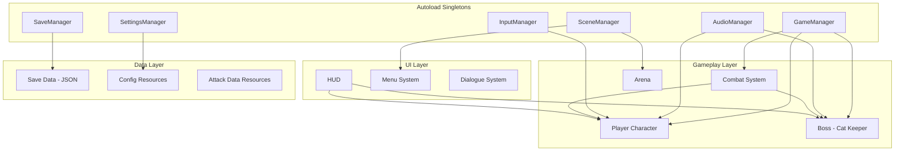
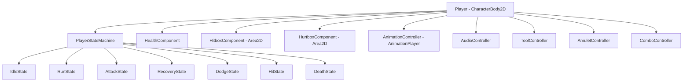
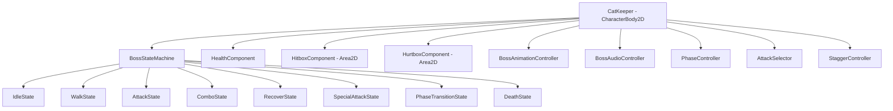

# Design Document: Ash & Purr

## Overview

Ash & Purr is a 2D arcade action game with soulslike combat built in Godot Engine 4.x using GDScript, targeting Windows Desktop at 1920×1080. The game features a single boss encounter (The Cat Keeper) with two combat phases, a player character (Bob) controlled via a finite state machine, a 3-hit combo system, amulet/tool equipment, and a checkpoint-based save system. The architecture follows a component-based design with six autoload singletons managing global concerns.

The design prioritizes frame-accurate combat, deterministic damage, responsive input, and readable visual/audio feedback. All systems are production-ready with no external plugins.

## Architecture

### High-Level Architecture



### Design Decisions

1. **Component-Based Architecture**: Each game entity (Player, Boss) is composed of small, single-responsibility components (HealthComponent, HitboxComponent, HurtboxComponent, etc.) attached as child nodes. This avoids monolithic scripts and enables reuse.

2. **Finite State Machines**: Both Player and Boss use explicit FSM patterns with discrete State classes. Each state handles its own enter/exit/process logic, preventing boolean spaghetti.

3. **Signal-Driven Communication**: Systems communicate via Godot signals rather than direct references, reducing coupling. Combat events (damage dealt, stagger triggered, phase transition) are broadcast as signals.

4. **Data-Driven Configuration**: Attack timings, damage values, knockback distances, and boss parameters are stored in Resource files, not hardcoded. This enables tuning without code changes.

5. **AnimationPlayer as Source of Truth**: All frame-accurate gameplay events (hitbox enable/disable, recovery start, sound cues) are synchronized via AnimationPlayer tracks and method call keys, never hardcoded timers.

6. **Autoload Singletons for Global State Only**: Singletons manage cross-scene concerns (audio routing, save persistence, scene transitions, input mapping, settings, game flow). No gameplay logic lives in autoloads.

## Components and Interfaces

### Player Character Components



#### PlayerStateMachine
- **Purpose**: Manages player state transitions with one active state at a time
- **Interface**:
  - `current_state: State` — the active state node
  - `transition_to(new_state: StringName) -> void` — validates and executes state transition
  - Signal: `state_changed(old_state, new_state)`
- **Rules**: Transitions are validated per-state (e.g., Attack cannot transition to Run until animation completes)

#### HealthComponent
- **Purpose**: Tracks current/max HP, applies damage modifiers from amulets
- **Interface**:
  - `current_health: int`, `max_health: int`
  - `take_damage(amount: int, source: Node) -> void`
  - `heal(amount: int) -> void`
  - `set_invulnerable(active: bool) -> void`
  - Signal: `health_changed(current, max)`
  - Signal: `died()`
  - Signal: `damage_taken(amount, source)`

#### HitboxComponent (Area2D)
- **Purpose**: Deals damage when overlapping a HurtboxComponent
- **Interface**:
  - `damage: int`, `knockback_force: float`, `knockback_direction: Vector2`
  - `hit_stop_frames: int`, `screen_shake_intensity: float`
  - `enable() -> void`, `disable() -> void`
  - Signal: `hit_landed(target: HurtboxComponent)`
- **Activation**: Enabled/disabled by AnimationPlayer keyframes per attack frame

#### HurtboxComponent (Area2D)
- **Purpose**: Receives damage from overlapping HitboxComponents
- **Interface**:
  - `is_invulnerable: bool`
  - Signal: `hurt(hitbox: HitboxComponent)`
- **Collision**: Uses dedicated collision layers (Player Hitbox → Boss Hurtbox, Boss Hitbox → Player Hurtbox)

#### ComboController
- **Purpose**: Manages the 3-hit combo sequence and chaining windows
- **Interface**:
  - `current_combo_step: int` (0 = no combo, 1-3 = active step)
  - `is_in_combo_window: bool`
  - `advance_combo() -> bool` — returns true if chain succeeds
  - `reset_combo() -> void`
  - Signal: `combo_completed()`
  - Signal: `combo_broken()`

#### ToolController
- **Purpose**: Manages equipped tool activation and cooldown
- **Interface**:
  - `equipped_tool: ToolResource`
  - `cooldown_remaining: float`
  - `is_on_cooldown: bool`
  - `activate_tool() -> void`
  - Signal: `tool_activated(tool)`
  - Signal: `cooldown_updated(remaining, total)`

#### AmuletController
- **Purpose**: Manages equipped amulet and stat modifiers
- **Interface**:
  - `equipped_amulet: AmuletResource`
  - `get_damage_modifier() -> float`
  - `get_defense_modifier() -> float`
  - `get_health_modifier() -> float`
  - `get_cooldown_modifier() -> float`
  - `equip(amulet: AmuletResource) -> void`
  - Signal: `amulet_changed(amulet)`

### Boss Components



#### BossStateMachine
- Same pattern as PlayerStateMachine but with boss-specific states
- States: Idle, Walk, Attack, Combo, Recover, SpecialAttack, PhaseTransition, Death

#### PhaseController
- **Purpose**: Tracks current phase and applies phase multipliers
- **Interface**:
  - `current_phase: int` (1 or 2)
  - `attack_speed_multiplier: float`
  - `recover_duration_multiplier: float`
  - `movement_speed_multiplier: float`
  - `shockwave_area_multiplier: float`
  - `trigger_phase_transition() -> void`
  - Signal: `phase_changed(new_phase)`

#### AttackSelector
- **Purpose**: Chooses next attack based on distance, history, and phase rules
- **Interface**:
  - `select_next_attack(player_distance: float) -> AttackResource`
  - `last_attack_type: StringName`
  - `get_startup_delay() -> float` — randomized within range
- **Rules**:
  - Never repeats same combo type consecutively
  - Close range (<3 widths): Basic Combo, Advanced Combo
  - Far range (>5 widths): Assault, Swift Slash
  - Phase 2: allows chaining Swift Slash, double Assault

#### StaggerController
- **Purpose**: Tracks hits during Recover windows and triggers stagger
- **Interface**:
  - `hits_during_recover: int`
  - `stagger_used_this_phase: bool`
  - `register_hit() -> void`
  - `reset_for_phase() -> void`
  - Signal: `stagger_triggered()`

### Combat System (CombatManager)

A scene-level node (not autoload) that coordinates combat interactions:

```gdscript
class_name CombatManager extends Node

signal hit_confirmed(attacker: Node, defender: Node, attack_data: AttackResource)
signal hit_stop_started(duration_frames: int)
signal screen_shake_requested(intensity: float, duration: float)
signal knockback_applied(target: Node, direction: Vector2, force: float)

func process_hit(hitbox: HitboxComponent, hurtbox: HurtboxComponent) -> void
func apply_hit_stop(duration_frames: int) -> void
func apply_screen_shake(intensity: float, duration: float) -> void
func apply_knockback(target: CharacterBody2D, direction: Vector2, force: float) -> void
```

### Autoload Singletons

#### GameManager
```gdscript
# Tracks global game state
var current_scene_id: StringName
var current_boss_phase: int
var is_player_alive: bool
var is_paused: bool

signal game_state_changed(property, value)
signal boss_defeated(boss_id)
```

#### AudioManager
```gdscript
# Routes all audio through dedicated buses
func play_sfx(stream: AudioStream, bus: StringName = "SFX") -> void
func play_music(stream: AudioStream, crossfade_duration: float = 0.0) -> void
func duck_music(amount_db: float, duration: float) -> void
func set_bus_volume(bus: StringName, linear: float) -> void

# Buses: Master, Music, SFX, UI, Ambience
```

#### SaveManager
```gdscript
# JSON serialization to user://
func save_game() -> bool
func load_game() -> SaveData
func has_save_data() -> bool
func delete_save() -> void

signal save_completed(success: bool)
signal load_completed(data: SaveData)
```

#### SceneManager
```gdscript
# Scene transitions with fade effects
func transition_to(scene_path: String, fade_duration: float = 0.3) -> void
func reload_current_scene() -> void

signal transition_started()
signal transition_completed()
```

#### SettingsManager
```gdscript
# Persists user preferences
var fullscreen: bool
var resolution: Vector2i
var master_volume: float  # 0.0 to 1.0
var music_volume: float
var sfx_volume: float
var brightness: float
var camera_shake_enabled: bool
var camera_shake_intensity: float  # 0.0 to 1.0
var hit_flash_intensity: float
var ui_scale: float  # 1.0, 1.25, 1.5
var subtitle_size: int  # 0=Small, 1=Medium, 2=Large

func save_settings() -> void
func load_settings() -> void

signal setting_changed(key, value)
```

#### InputManager
```gdscript
# Input mapping and device detection
var active_device: StringName  # "keyboard" or "controller"

func get_action_key(action: StringName) -> String
func rebind_action(action: StringName, event: InputEvent) -> bool
func has_conflict(action: StringName, event: InputEvent) -> StringName
func save_bindings() -> void
func load_bindings() -> void

signal device_changed(device: StringName)
signal binding_changed(action: StringName)
```

### Collision Layer Assignment

| Layer | Name | Purpose |
|-------|------|---------|
| 1 | Environment | Arena walls, floor, ceiling |
| 2 | Player Body | Player CharacterBody2D |
| 3 | Boss Body | Boss CharacterBody2D |
| 4 | Player Hitbox | Player attack hitboxes |
| 5 | Player Hurtbox | Player damage reception |
| 6 | Boss Hitbox | Boss attack hitboxes |
| 7 | Boss Hurtbox | Boss damage reception |
| 8 | Triggers | Checkpoints, dialogue triggers |
| 9 | Projectiles | Throwing Knife, shockwaves |

- Player Hitbox (Layer 4) masks Boss Hurtbox (Layer 7)
- Boss Hitbox (Layer 6) masks Player Hurtbox (Layer 5)
- Projectiles (Layer 9) masks Boss Hurtbox (Layer 7)
- Shockwaves (Layer 9) masks Player Hurtbox (Layer 5)

## Data Models

### AttackResource
```gdscript
class_name AttackResource extends Resource

@export var attack_name: StringName
@export var damage: int
@export var hitbox_start_frame: int
@export var hitbox_end_frame: int
@export var combo_window_start_frame: int
@export var combo_window_end_frame: int
@export var hit_stop_frames: int  # 3-6 for player, 4-8 for boss
@export var screen_shake_pixels: float  # 2-8 for player hits, 4-10 for boss hits
@export var knockback_pixels: float  # 30-120 for player hits, 50-150 for boss hits
@export var knockback_direction: Vector2
@export var animation_name: StringName
@export var total_frames: int
@export var recovery_frames: int
```

### AmuletResource
```gdscript
class_name AmuletResource extends Resource

@export var amulet_name: StringName
@export var display_name: String
@export var description: String
@export var icon: Texture2D
@export var damage_modifier: float  # 1.0 = no change, 1.25 = +25%
@export var defense_modifier: float  # 1.0 = no change, 0.8 = -20% damage received
@export var health_modifier: float  # 1.0 = no change, 1.3 = +30% max HP
@export var cooldown_modifier: float  # 1.0 = no change, 1.3 = +30% cooldown
```

### ToolResource
```gdscript
class_name ToolResource extends Resource

@export var tool_name: StringName
@export var display_name: String
@export var description: String
@export var icon: Texture2D
@export var damage_multiplier: float  # relative to base branch damage
@export var cooldown_seconds: float
@export var startup_frames: int
@export var tool_type: ToolType  # MELEE, RANGED, HEALING
@export var projectile_scene: PackedScene  # null for melee/healing

enum ToolType { MELEE, RANGED, HEALING }
```

### BossPhaseConfig
```gdscript
class_name BossPhaseConfig extends Resource

@export var phase_number: int
@export var attack_speed_multiplier: float  # 1.0 for P1, >= 1.3 for P2
@export var recover_duration_multiplier: float  # 1.0 for P1, <= 0.5 for P2
@export var movement_speed_multiplier: float  # 1.0 for P1, >= 1.3 for P2
@export var shockwave_area_multiplier: float  # 1.0 for P1, >= 1.5 for P2
@export var can_chain_swift_slash: bool  # false P1, true P2
@export var can_double_assault: bool  # false P1, true P2
@export var min_telegraph_frames: int  # 12 P1, 8 P2
```

### SaveData Structure (JSON)
```json
{
  "version": 1,
  "current_level": "arena_cat_keeper",
  "boss_progression": {
    "cat_keeper": { "defeated": false, "phase_reached": 1 }
  },
  "unlocked_amulets": ["photograph", "collar", "fish_plush"],
  "unlocked_tools": ["throwing_knife", "short_sword", "small_mace", "dreamcatcher"],
  "equipped_amulet": "photograph",
  "equipped_tool": "throwing_knife",
  "player_statistics": {
    "deaths": 0,
    "damage_dealt": 0,
    "damage_taken": 0,
    "dodges_performed": 0,
    "staggers_triggered": 0
  },
  "game_completion": false,
  "collectibles": []
}
```

### Settings Data Structure (JSON)
```json
{
  "display": {
    "fullscreen": true,
    "resolution": [1920, 1080],
    "brightness": 1.0
  },
  "audio": {
    "master_volume": 1.0,
    "music_volume": 0.8,
    "sfx_volume": 1.0,
    "ui_volume": 0.7,
    "ambience_volume": 0.6
  },
  "accessibility": {
    "camera_shake_enabled": true,
    "camera_shake_intensity": 1.0,
    "hit_flash_intensity": 1.0,
    "ui_scale": 1.0,
    "subtitle_size": 1,
    "subtitle_background": false
  },
  "input": {
    "keyboard": {},
    "controller": {}
  }
}
```

### Folder Structure
```
res://
├── Scenes/
│   ├── Player/
│   │   └── Player.tscn
│   ├── Bosses/
│   │   └── CatKeeper.tscn
│   ├── Levels/
│   │   └── Arena_CatKeeper.tscn
│   ├── UI/
│   │   ├── HUD.tscn
│   │   ├── MainMenu.tscn
│   │   ├── PauseMenu.tscn
│   │   ├── DeathScreen.tscn
│   │   ├── VictoryScreen.tscn
│   │   └── DialogueWindow.tscn
│   ├── Effects/
│   │   ├── HitEffect.tscn
│   │   └── Shockwave.tscn
│   ├── Objects/
│   │   └── ThrowingKnife.tscn
│   └── Checkpoints/
│       └── Checkpoint.tscn
├── Scripts/
│   ├── Player/
│   │   ├── player.gd
│   │   ├── player_state_machine.gd
│   │   └── States/
│   │       ├── idle_state.gd
│   │       ├── run_state.gd
│   │       ├── attack_state.gd
│   │       ├── recovery_state.gd
│   │       ├── dodge_state.gd
│   │       ├── hit_state.gd
│   │       └── death_state.gd
│   ├── Bosses/
│   │   ├── cat_keeper.gd
│   │   ├── boss_state_machine.gd
│   │   ├── attack_selector.gd
│   │   ├── phase_controller.gd
│   │   └── States/
│   │       ├── boss_idle_state.gd
│   │       ├── boss_walk_state.gd
│   │       ├── boss_attack_state.gd
│   │       ├── boss_combo_state.gd
│   │       ├── boss_recover_state.gd
│   │       ├── boss_special_attack_state.gd
│   │       ├── boss_phase_transition_state.gd
│   │       └── boss_death_state.gd
│   ├── Components/
│   │   ├── health_component.gd
│   │   ├── hitbox_component.gd
│   │   ├── hurtbox_component.gd
│   │   ├── combo_controller.gd
│   │   ├── tool_controller.gd
│   │   ├── amulet_controller.gd
│   │   └── stagger_controller.gd
│   ├── Combat/
│   │   └── combat_manager.gd
│   ├── Managers/
│   │   ├── game_manager.gd
│   │   ├── audio_manager.gd
│   │   ├── save_manager.gd
│   │   ├── scene_manager.gd
│   │   ├── settings_manager.gd
│   │   └── input_manager.gd
│   ├── UI/
│   │   ├── hud.gd
│   │   ├── main_menu.gd
│   │   ├── pause_menu.gd
│   │   ├── death_screen.gd
│   │   ├── victory_screen.gd
│   │   └── dialogue_system.gd
│   └── Save/
│       └── save_data.gd
├── Resources/
│   ├── Attacks/
│   │   ├── player_attack_1.tres
│   │   ├── player_attack_2.tres
│   │   ├── player_attack_3.tres
│   │   ├── boss_basic_combo.tres
│   │   ├── boss_advanced_combo.tres
│   │   ├── boss_swift_slash.tres
│   │   ├── boss_assault.tres
│   │   └── boss_seismic_strike.tres
│   ├── Amulets/
│   │   ├── photograph.tres
│   │   ├── collar.tres
│   │   └── fish_plush.tres
│   ├── Tools/
│   │   ├── throwing_knife.tres
│   │   ├── short_sword.tres
│   │   ├── small_mace.tres
│   │   └── dreamcatcher.tres
│   └── Config/
│       ├── boss_phase_1.tres
│       └── boss_phase_2.tres
├── Sprites/
├── Animations/
├── Audio/
│   ├── Music/
│   └── SFX/
├── Fonts/
├── Shaders/
└── Autoload/
    ├── game_manager.tscn
    ├── audio_manager.tscn
    ├── save_manager.tscn
    ├── scene_manager.tscn
    ├── settings_manager.tscn
    └── input_manager.tscn
```


## Correctness Properties

*A property is a characteristic or behavior that should hold true across all valid executions of a system—essentially, a formal statement about what the system should do. Properties serve as the bridge between human-readable specifications and machine-verifiable correctness guarantees.*


### Property 1: Player FSM Valid Transitions

*For any* player state and any input event, the PlayerStateMachine SHALL only transition to states permitted by the current state's transition table (Idle→Run/Attack/Dodge, Run→Idle/Attack/Dodge, Attack→Recovery/Hit/Death, Recovery→Run/Dodge/Attack(after completion)/Hit/Death, Dodge→Idle(after completion)/Death, Hit→Idle(after completion)/Death, Death→none), and no transition SHALL occur while a state-locking animation (Attack, Dodge) is still playing.

**Validates: Requirements 1.2, 1.3, 1.4, 1.5, 1.8, 1.9, 1.10**


### Property 2: Damage Causes Hit State When Vulnerable

*For any* damage event applied to the Player_Character while the Player_Character is not in the Dodge state and invulnerability frames are not active, the Player_Character SHALL transition to the Hit state, and when health reaches zero the Player_Character SHALL transition to the Death state with all input processing disabled.

**Validates: Requirements 1.6, 1.7, 4.3**


### Property 3: Instant Movement Response

*For any* horizontal movement input change (start, stop, or direction reversal), the Player_Character SHALL reach the target velocity (300 px/s in input direction, or 0 px/s on release) within exactly one physics frame, and while in Attack, Recovery, Dodge, Hit, or Death states, movement input SHALL produce zero horizontal velocity change.

**Validates: Requirements 2.1, 2.2, 2.3, 2.5, 2.6**


### Property 4: Combo Chaining Within Window

*For any* attack input received during the combo window (10 to 15 animation frames after the previous attack's hitbox deactivates), the ComboController SHALL advance to the next combo step (up to 3 maximum), and for any attack input received outside the combo window or after the third hit, the combo SHALL NOT advance and the Player_Character SHALL transition to Recovery.

**Validates: Requirements 3.2, 3.3**


### Property 5: Deterministic Damage and Combat Feedback

*For any* confirmed hit (Player Hitbox overlapping Boss Hurtbox), the Combat_System SHALL apply identical damage values for the same AttackResource regardless of when or how many times it is used, and SHALL simultaneously apply hit stop (3-6 frames), screen shake (2-8 pixels scaled linearly with damage), and knockback (30-120 pixels in attack direction) as defined in the AttackResource.

**Validates: Requirements 3.5, 3.6, 9.1, 9.2, 9.3**


### Property 6: Combo Cancellation on Damage

*For any* damage received by the Player_Character during an active combo (combo_step > 0), the ComboController SHALL reset the combo to step 0 and the Player_Character SHALL transition to the Hit state, abandoning remaining combo strikes.

**Validates: Requirements 3.7**


### Property 7: I-Frames Prevent All Damage

*For any* overlapping Boss Hitbox with the Player Hurtbox while invulnerability frames are active (during Dodge state, during phase transition), the Player_Character SHALL receive zero damage and no Hit state transition SHALL occur.

**Validates: Requirements 4.2, 4.3, 8.1**


### Property 8: Boss Attack Selection Distance Rules

*For any* Boss_AI attack selection in Phase 1, if the Player_Character is within 3 character-widths the selected attack SHALL be a close-range attack (Basic Combo or Advanced Combo), and if beyond 5 character-widths the selected attack SHALL be a gap-closing attack (Assault or Swift Slash), and the same combo type SHALL NOT be selected twice in immediate succession.

**Validates: Requirements 5.3, 5.4**


### Property 9: Boss Attack Timing Variation

*For any* two consecutive uses of the same Boss_AI attack, the startup delay SHALL differ, with each delay independently randomized within the range 0.8 to 1.5 seconds, and for any Basic Combo execution the inter-strike delays SHALL be independently randomized within 8 to 20 animation frames, and for any Advanced Combo the strikes SHALL alternate between slow (18-24 frames) and fast (8-12 frames) timing.

**Validates: Requirements 5.5, 6.1, 6.4**


### Property 10: Boss Recover Provides Punish Window

*For any* completed Boss combo (Basic or Advanced), the Cat_Keeper SHALL enter the Recover state for a duration between 1.0 and 1.8 seconds, and the Advanced Combo Recover duration SHALL be at least 1.5× the Basic Combo Recover duration.

**Validates: Requirements 5.7, 6.6**


### Property 11: Boss Counterattack on Interrupted Combo

*For any* Player_Character attack that hits the Cat_Keeper during an active Basic Combo or Advanced Combo before all strikes complete, the Cat_Keeper SHALL cancel remaining combo strikes and execute a counterattack within 6 animation frames.

**Validates: Requirements 6.7**


### Property 12: Special Attack Telegraphs

*For any* Cat_Keeper special attack (Swift Slash, Assault, Seismic Strike), a unique visual telegraph animation and unique audio cue SHALL begin at least 12 animation frames (Phase 1) or 8 animation frames (Phase 2) before the attack Hitbox becomes active, and the audio telegraph SHALL play at least 300 milliseconds before the hitbox activates.

**Validates: Requirements 7.6, 8.9, 15.2**


### Property 13: Phase 2 Multipliers Applied Correctly

*For any* Cat_Keeper action in Phase 2, the attack speed multiplier SHALL be at least 1.3× Phase 1, the Recover duration multiplier SHALL be at most 0.5× Phase 1, the movement speed SHALL be at least 1.3× Phase 1, and Seismic Strike shockwave area SHALL be at least 1.5× Phase 1, with all multipliers exposed as configurable parameters in BossPhaseConfig.

**Validates: Requirements 8.3, 8.4, 8.7, 8.8**


### Property 14: Phase 2 Attack Chaining Rules

*For any* Phase 2 combat sequence, the Boss_AI SHALL allow Swift Slash to chain without entering Recover afterward, and SHALL allow Assault to be performed twice in immediate succession, while these chains are forbidden in Phase 1.

**Validates: Requirements 8.5, 8.6**


### Property 15: Amulet Modifier Application

*For any* equipped amulet and any base damage/defense/health/cooldown value, the AmuletController SHALL apply the correct multiplicative modifier (Photograph: 1.25× damage dealt, 1.25× damage received; Collar: 0.8× damage received, 1.3× cooldown; Fish Plush: 1.3× max health, 0.8× damage dealt), and with no amulet equipped all modifiers SHALL equal 1.0.

**Validates: Requirements 10.2, 10.3, 10.4, 10.7**


### Property 16: Equipment Slot Invariant

*For any* equip operation on the Amulet_System or Tool_System, exactly one item (or none) SHALL be equipped at a time, equipping a new item SHALL replace the previous item, and while in active combat (inside Arena with Cat_Keeper alive) amulet/tool change attempts SHALL be rejected.

**Validates: Requirements 10.1, 10.5, 11.1**


### Property 17: Tool Cooldown Enforcement

*For any* tool activation, the ToolController SHALL start a cooldown timer of the tool's specified duration, and any activation input received while the cooldown is active SHALL be ignored and produce no effect.

**Validates: Requirements 11.6, 11.7**


### Property 18: Save/Load Round-Trip Preservation

*For any* game state (equipped amulet, equipped tool, boss progression, player statistics, settings, key bindings), serializing to JSON via SaveManager/SettingsManager and then deserializing SHALL produce an identical game state, preserving all fields without data loss or corruption.

**Validates: Requirements 10.6, 11.8, 16.2, 18.4, 19.1, 19.3**


### Property 19: Stagger Mechanic Constraints

*For any* Cat_Keeper Recover state window during which the Player_Character lands 3 or more hits, a Stagger SHALL trigger (pausing boss for 2 seconds), and Stagger SHALL activate at most once per boss phase, resetting the allowance only on phase transition.

**Validates: Requirements 22.1, 22.2, 22.3**


### Property 20: Dialogue Input Restriction and Advance

*For any* active dialogue window, Player_Character movement and combat inputs SHALL be blocked, and pressing the advance input while text is typing SHALL complete the current line immediately, and pressing advance while the line is fully displayed SHALL advance to the next line or close the dialogue window.

**Validates: Requirements 14.3, 14.4, 14.5**


### Property 21: Input Rebinding Conflict Detection

*For any* key or button rebind attempt where the new binding is already assigned to another action on the same input device, the InputManager SHALL detect the conflict and require explicit player confirmation before applying the reassignment, and SHALL never allow silent duplicate bindings.

**Validates: Requirements 18.3, 18.7**


### Property 22: Checkpoint Health Restoration and Equipment Access

*For any* checkpoint activation, the Player_Character health SHALL be restored to maximum, and while within the checkpoint area the Amulet_System and Tool_System SHALL allow equipment changes, and upon exit equipment changes SHALL be locked until the next checkpoint.

**Validates: Requirements 16.1, 16.4**


### Property 23: Volume Settings Bounded Range

*For any* audio bus volume setting or accessibility slider (camera shake intensity, hit flash intensity), the value SHALL be constrained to the range 0.0 to 1.0 (representing 0% to 100%) with increments no larger than 0.1 (10%), and setting a value outside this range SHALL clamp to the nearest valid value.

**Validates: Requirements 15.7, 20.1, 20.2**


### Property 24: Pause Freezes Simulation

*For any* pause input during active gameplay, the Game SHALL freeze all gameplay simulation (physics, AI, timers, animations) within the same frame and display the Pause Menu, and resume SHALL restore simulation from the exact frozen state.

**Validates: Requirements 13.3**


### Property 25: Scene Transition Fade Duration

*For any* scene transition triggered by the SceneManager, the combined fade-out and fade-in effect SHALL complete within 200 to 500 milliseconds, and the retry action from the death screen SHALL reset both Player_Character and Cat_Keeper to initial states (full health, Phase 1, starting positions) within 1 second.

**Validates: Requirements 23.2, 23.4**


## Error Handling

### Save System Errors

| Error Condition | Handling Strategy |
|----------------|-------------------|
| Save file write failure (disk full, permissions) | Display "Save Failed" notification, retain previous valid save data, log error to console |
| Save file corrupted/unreadable on load | Create new save with default values, display "New save created" notification |
| Save file missing on load | Create new save with default values silently (first launch behavior) |
| Save file version mismatch | Attempt migration; if impossible, create new save with notification |
| JSON parse error | Treat as corruption, fall back to defaults |

### Resource Loading Errors

| Error Condition | Handling Strategy |
|----------------|-------------------|
| Missing scene file on transition | Log error, remain on current scene, display error notification |
| Missing attack resource | Use fallback default attack data (zero damage, standard timing) |
| Missing audio stream | Skip playback silently, log warning |
| Missing texture/sprite | Use placeholder magenta texture, log warning |
| Node reference null | Validate with `is_instance_valid()` before access, skip operation if invalid |

### Input System Errors

| Error Condition | Handling Strategy |
|----------------|-------------------|
| Controller disconnected mid-gameplay | Pause game automatically, display "Controller disconnected" prompt |
| Invalid rebind attempt (system key) | Reject binding, display informational message |
| Corrupted bindings file | Reset to default bindings, notify player |

### Combat System Errors

| Error Condition | Handling Strategy |
|----------------|-------------------|
| Hitbox/Hurtbox overlap detection fails | Area2D monitors enabled by default; validate collision layers at scene ready |
| AnimationPlayer callback missed | States have timeout fallbacks to prevent permanent state locks |
| Boss AI stuck in state | Recover state has maximum duration timeout (3s) forcing transition |
| Physics frame spike | Hit stop and i-frame durations use frame counts not wall-clock time, ensuring consistency |

### General Principles

1. **Never crash**: All potential null references checked before access
2. **Graceful degradation**: Missing assets produce warnings, not errors
3. **State recovery**: FSM states have timeout mechanisms preventing permanent locks
4. **Data preservation**: Save operations never overwrite until new data is fully validated
5. **User communication**: Errors affecting player experience show brief, non-intrusive notifications


## Testing Strategy

### Overview

Testing follows a dual approach combining unit tests for specific scenarios with property-based tests for universal invariants. GdUnit4 is the testing framework for Godot 4.x GDScript, providing both example-based and property-based testing capabilities.

### Property-Based Testing

**Library**: GdUnit4 with custom property test helpers
**Minimum iterations**: 100 per property test
**Tag format**: `# Feature: ash-and-purr, Property {number}: {property_text}`

Property-based tests target the pure logic layer:
- **PlayerStateMachine transition logic** (Properties 1, 2)
- **Movement calculations** (Property 3)
- **ComboController timing logic** (Properties 4, 6)
- **Combat damage calculations** (Properties 5, 15)
- **AttackSelector distance-based selection** (Properties 8, 9)
- **PhaseController multiplier application** (Properties 13, 14)
- **StaggerController hit counting** (Property 19)
- **Save/Load serialization round-trip** (Property 18)
- **Settings range validation** (Property 23)
- **Input rebinding conflict detection** (Property 21)
- **Tool cooldown enforcement** (Property 17)
- **Equipment slot management** (Property 16)

### Unit Tests (Example-Based)

Unit tests cover specific scenarios and integration points:

| System | Test Cases |
|--------|------------|
| Player FSM | Each state entered/exited correctly, animation callbacks fire |
| Combo System | 1-hit, 2-hit, 3-hit sequences; window expiry; damage cancellation |
| Boss AI | Basic Combo 3 strikes; Advanced Combo 5 strikes; specific attack selection at boundary distances |
| Tool System | Each tool activation produces correct effect (knife projectile, sword slash, mace impact, dreamcatcher heal) |
| Amulet System | Each amulet applies correct modifiers; no-amulet baseline |
| HUD | Health bar updates on damage; cooldown indicator changes on tool use; boss bar hides on defeat |
| Menus | Main menu options present; Continue disabled without save; pause freezes tree |
| Dialogue | Text typing speed; advance completes text; portrait shown when specified |
| Audio | Bus routing; music crossfade on phase transition; SFX telegraph timing |
| Save System | Save creates valid JSON; load restores state; corruption handled gracefully |
| Checkpoint | Health restored; equipment changes allowed; boss defeat persisted |
| Arena | Boundaries prevent exit; z-ordering correct; particles within limits |

### Integration Tests

Integration tests verify system interactions:

- **Full combat loop**: Player attacks boss → damage applied → feedback triggered → boss responds
- **Phase transition**: Boss reaches 40% → transition animation → Phase 2 multipliers active
- **Death → Retry flow**: Player dies → death screen → retry → full reset
- **Checkpoint → Boss flow**: Activate checkpoint → change equipment → enter arena → equipment locked
- **Save round-trip**: Play session → checkpoint save → quit → load → state restored

### Performance Tests

- Arena with all particle emitters active maintains 60 FPS
- Scene transitions complete within timing requirements
- No memory growth over 10 consecutive retry cycles

### Test Organization

```
res://Tests/
├── Unit/
│   ├── test_player_state_machine.gd
│   ├── test_combo_controller.gd
│   ├── test_combat_manager.gd
│   ├── test_attack_selector.gd
│   ├── test_phase_controller.gd
│   ├── test_stagger_controller.gd
│   ├── test_amulet_controller.gd
│   ├── test_tool_controller.gd
│   ├── test_health_component.gd
│   ├── test_save_manager.gd
│   ├── test_settings_manager.gd
│   ├── test_input_manager.gd
│   └── test_dialogue_system.gd
├── Property/
│   ├── test_fsm_transitions_property.gd
│   ├── test_movement_property.gd
│   ├── test_combo_timing_property.gd
│   ├── test_damage_determinism_property.gd
│   ├── test_attack_selection_property.gd
│   ├── test_phase_multipliers_property.gd
│   ├── test_amulet_modifiers_property.gd
│   ├── test_save_roundtrip_property.gd
│   ├── test_stagger_property.gd
│   ├── test_cooldown_property.gd
│   ├── test_settings_range_property.gd
│   └── test_rebinding_conflict_property.gd
└── Integration/
    ├── test_combat_loop.gd
    ├── test_phase_transition.gd
    ├── test_death_retry_flow.gd
    └── test_checkpoint_flow.gd
```

### Key Testing Constraints

1. All property tests run minimum 100 iterations with randomized inputs
2. Combat tests use mocked AnimationPlayer to control frame-accurate timing
3. Save tests use temporary directories cleaned after each test
4. Boss AI tests mock random number generation for deterministic verification of ranges
5. No tests require the full game scene — each system is testable in isolation via its component
6. Tests reference their corresponding design property via tag comments
